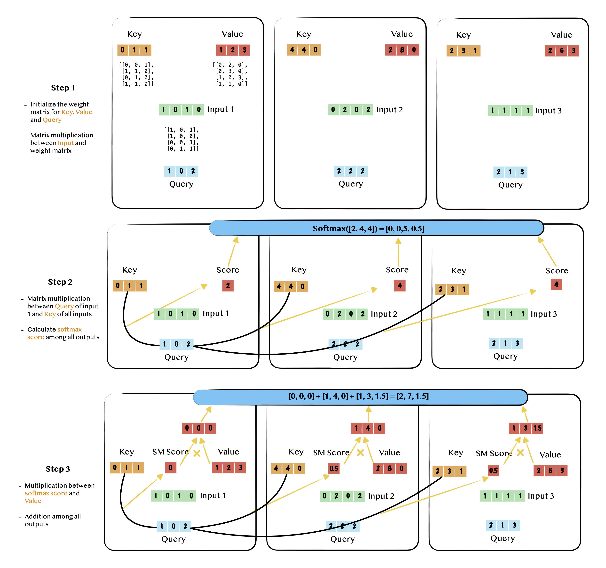

# What is self-attention?

## **Defintion of Attention Mechanism**

The ***Attention Mechanism*** is a technique used in neural networks to dynamically focus on certain parts of the input data over others, enhancing the model's ability to learn and interpret complex data patterns.  This definition is from ChatGPT, but in a simple word, the attention mechanism attempts to emphraize certain parts while ignore others.  An example here is as follow ([source](https://easyaitech.medium.com/%E4%B8%80%E6%96%87%E7%9C%8B%E6%87%82-attention-%E6%9C%AC%E8%B4%A8%E5%8E%9F%E7%90%86-3%E5%A4%A7%E4%BC%98%E7%82%B9-5%E5%A4%A7%E7%B1%BB%E5%9E%8B-e4fbe4b6d030#:~:text=Attention%20%E7%9A%84%E6%9C%AC%E8%B4%A8%E6%98%AF%E4%BB%80%E4%B9%88,%E4%BA%86%E5%9B%BE%E7%89%87%E7%9A%84%E7%84%A6%E7%82%B9%E4%B8%8A%E3%80%82)). When you look at the picture below, you attention will highly possbile be attracted by "锦江饭店" rather than other elements such as the telephone number above it and "喜运来大饭店" behind it. This explains what we want to achieve via the ***Attention Mechanism.***

## Self-attention and the intuition behind

Self-attention is the most important branch in the family of ***Attention Mechanism*** and it attempts to highlight the relationship between the target element and its neighbors. For example, if you have sentence **I want to go home for dinner because we will have hotpot tonight**, probably the attention should be paid to words <u>home</u> ,<u>dinner</u> and <u>hotpot.</u> So what should we do to achieve this? 

For each word, we can vectorize it via some mathmetical techniques, e.g., $v_1$ = vectorize_function("I"). Then we have:
$$
[v_1, v_2, v_3, ..., v_{n}],\; v_i \in \R^{1\times m}
$$

The intuitive way to calculate the similarity among each vector is the dot operation $v_1 \cdot v_2$. If we use $s_{12}$ to denote the similarity between $v_1$ and $v_2$,  the similarity matrix will be 
$$
S = \begin{bmatrix}
s_{11} & s_{12} & s_{13} & ... & s_{1n} \\
s_{21} & s_{22} & s_{23} & ... & s_{2n} \\
\vdots & \vdots & \vdots & \vdots & \vdots \\
s_{n1} & s_{n2} & s_{n3} & ... & s_{nn} \\
\end{bmatrix} \in \R^{n\times n}
$$
These similarities can be weight scores if we normalize them using techinique like softmax(), e.g., softmax($s_{12}$) denote the normalized score between the first and the second word.  Now suppose we have scores between the first word and all other words (including itself), we can derive a new "first word" by applying the weight sum approach among all words, i.e., 
$$
\hat v_1 = \sum_{i=1}^n {Softmax(s_{1i})v_{i}} \in \R^{1 \times m}
$$
The process of deriving the vector sequence $[\hat v_1, \hat v_2, \hat v_3, ..., \hat v_{n}]$​ is exactly what self-attention is doing.  

## How can self-attention be integrated into deep learning?

If self-attention is only doing dot operation between any two elements, then no learnable parameters are introduced. To make it learnable, we can introduce three different derivatives from the raw $v_{i}$​​, they are `key`($K$), `query`($Q$) and `value`($V$).  $Q$, $K$, and $V$ are calculated using three different weight matrix $w_k$, $w_q$ and $w_v$ with the same dimension (Step 1). 
$$
k_i=v_iw_k, w_k \in \R^{n\times m} \\
q_i=v_iw_q, w_q \in \R^{n\times m} \\
v_i=v_iw_v, w_v \in \R^{n\times m}
$$
The dot operation in eq(1) is happening between $K$ and $Q$
$$
s_{ij} = q_i\cdot k_j
$$
Apply softmax() to all $s_{ij}$​ to normalize them to get the attention score (Step 2).

Multiply the attention score and $V$ and sum them up to get the $\hat v$ (Step 3)
$$
\hat v_1 = \sum_{i=1}^n {Softmax(s_{1i})v_{i}} \in \R^{1 \times m}
$$
